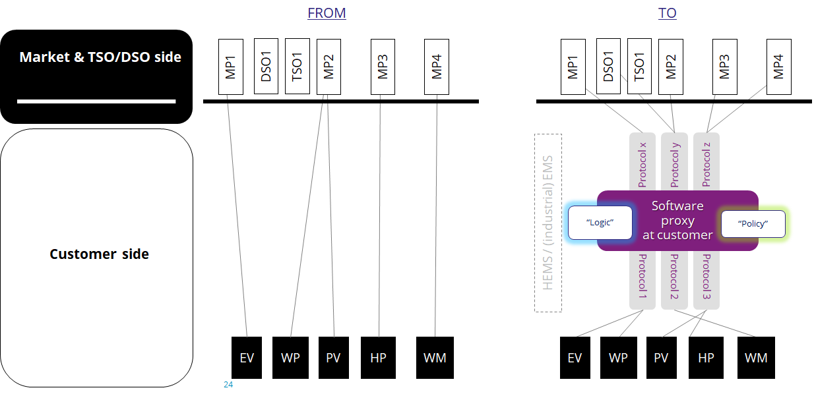

# ReLevENT, an integration project of DER-scheduling (OSS) with FledgePower (OSS)
ReLevENT stands for "**Re**silient **Lev**erage for **E**nergy-edge **N**ative **T**echnology".
The development goal is to supply a production grade general software stack to control edge devices (like EV-chargers, heat-pumps, Home-energy-management-systems, PV-solar) to market parties that enables to interact with more actors with their own communication protocols and needs. The implementation of usable-functionality takes place step by step where the 'production grade' label is key.

# Business goals
The business goals related to energy systems and controling in the edge are:
1. Enable market parties and grid users to use all different protocols to their need (unlock the “best protocol dilimma”).
2. Improve the resilience in the edge
3. Improve the quality, compliancy and go to market for hardware suppliers.

Image to business goal 1 explains the current situation where each market party (e.g. energy supplier, charging point operator, congestion service provider, ...) and each DSO or TSO like to see their own preferred communication protocol be deployed to all devices at end customers in the edge. Everybody optimized for their own use-case, but at customers this leads to silo-ed solutions. In the right part you see the to-be situation where we want to enable a proxy respecting all optimized protocols. The proxy doesn't realize the harmonization in the protocol, but in the functionality.

For a more detailed understanding, also see [the Use-Cases section.](./usecases/)

## Related projects
The integration is based on the following repositories:
1. https://github.com/alliander-opensource/der-scheduling
2. https://github.com/fledge-power[https://github.com/fledge-power]

## Collaboration and contributing
This is a collaboration of [Alliander](alliander.com), [Fraunhofer ISE](https://www.ise.fraunhofer.de/) and [MZ Automation](https://www.mz-automation.de) and you are welcome to contribute with your expertise on raising issues, contributing to documentation, testing, making suggestions or writing code. The final acceptance of the code is done by a Technical Steering Committee with the members stated above and consulting the Technical Steering Committee of FledgePower.

The work is based upon MZ Automation's [IEC 61850 Protocol Library](https://www.mz-automation.de/communication-protocols/iec-61850-protocol-library/).

## Roadmap
### Scheduling as stand alone-service (realized!)
This has been realized till sofar at [DER-scheduling-software](https://github.com/alliander-opensource/der-scheduling). The main functionalities are to control a DERs regarding:
- absolute power output
- maximal power output
- turning them on or off

The configuration of how the software is configured is realized with the [SCL file](https://github.com/alliander-opensource/der-scheduling/blob/main/models/der_scheduler.cid) which can be managed and adopted by any SCL compliant tool, e.g. [CoMPAS](https://github.com/com-pas). Schedules themselves are now fed into the software with an API from the CLI.
With positive results, the solution is benchmarked against German commercial FNN-steuerboxes to have the same behaviour and to have at least the same performance.

### Scheduling integraded with official communication protol (active!)
We currently integrate the IEC scheduling as stand-service into [FLEDGE](https://www.lfedge.org/projects/fledge/) in close collaboration with [FLEDGE POWER](https://lfenergy.org/projects/fledgepower/) as they share the vision to build productive software for the edge. (Please remark that "scheduling" in Fledge is not the same as IEC-scheduling or DER-scheduling developed here). In this stage we expect to communicate with one protocol (WAN at IEC61850-MMS) to central systems (SCADA / Substation automation like) and with one protocol (LAN at MQTT) to local devices.

### Scheduling integrated with several exchangable communication protocols (stretched goal)
In this stage we expect to have the integration as such, that it is possible to use more protocols to central systems (WAN) and more protocols to local devices (LAN) independently and parallell from each other.

### Scheduling integrated with security framework for registration, monitoring etc.
In this stage we expect to have the right features and in place so that this solution can be used on broader scale securely. A basis (partly outated) in Dutch language can be found [here](https://alliander.gitbook.io/interfacespecificatie-elektriciteit-productie-eenh/bijlage_3_gemaakte_keuzes_en_toelichting). 

## Architecture
The architecture defines the possibilities and limitations of the delivery.
In the first phase, the integration with Fledge-Power will be solid, but limited to a selected number of services only. This will guarantee the core functionality when more advanced integration can evaluate with both architectures.
More information about the architectural choises, see section -Architecture-

