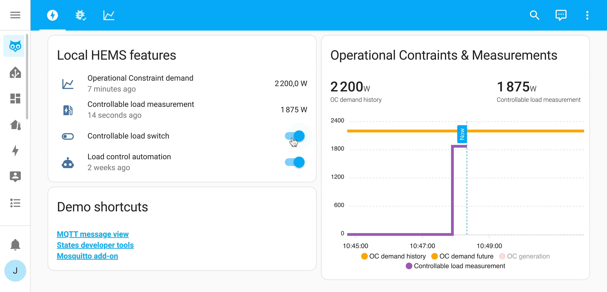
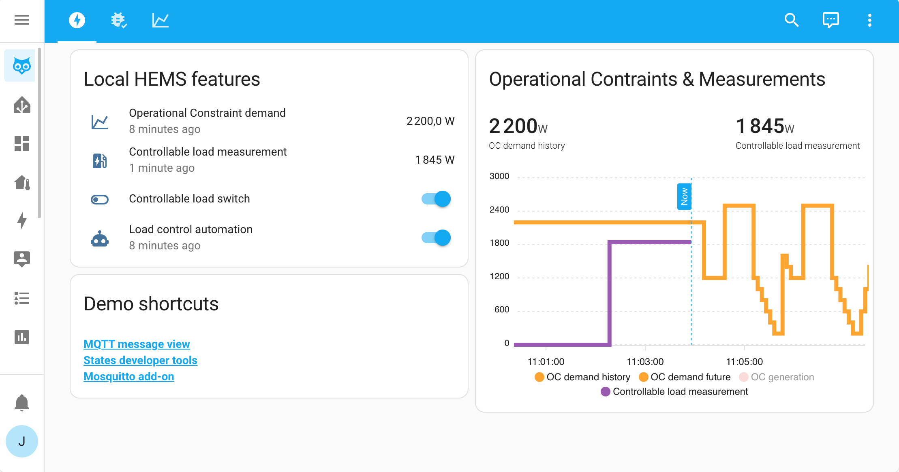
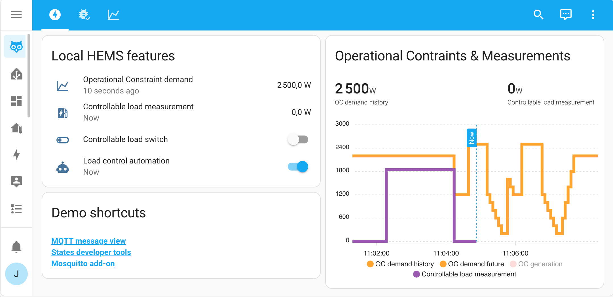

# Home Assistant with DSO profiles
These demo instructions describe a proof-of-concept set-up to get capacity profiles communicated by a DSO (Distribution System Operator, such as Liander) available within Home Assistant. After following these instructions you should be able to reproduce the video below:

https://github.com/alliander-opensource/ReLevENT/assets/58041016/8ab08547-4a0c-4b70-a9d6-2518d192b12d

Please note these are *demo* instructions, as of February 2024 this solution is not in production.

<!-- TOC -->
* [Home Assistant with DSO profiles](#home-assistant-with-dso-profiles)
  * [Assumed pre-installed configurations](#assumed-pre-installed-configurations)
  * [Initial configuration](#initial-configuration)
    * [Configuring a local MQTT broker (optional)](#configuring-a-local-mqtt-broker-optional)
    * [Connecting to the MQTT broker](#connecting-to-the-mqtt-broker)
      * [Direct connection](#direct-connection)
      * [Bridged connection](#bridged-connection)
    * [Setting up an MQTT sensor](#setting-up-an-mqtt-sensor)
  * [Creating an automation](#creating-an-automation)
  * [Visualization](#visualization)
    * [History only using build-in card](#history-only-using-build-in-card)
    * [History and future using apex-charts](#history-and-future-using-apex-charts)
  * [Demo time!](#demo-time)
<!-- TOC -->

## Assumed pre-installed configurations
Before we start, you are assumed to have the following working:
1. A Hedera endpoint for which capacity profiles are published #todo link to Daniel
2. A Hedera gateway to request capacity profiles (optional) #todo link to Daniel
3. An MQTT broker. 
4. Fledgepower set up and running, publishing MQTT messages to the above broker
5. A power measurement measuring some connection
6. A controllable load connected to that same connection 

For point 5 and 6, this demo uses a Zigbee power outlet plug with integrated power measurement. In a real use-case, the controllable load could also be an EV charging point, a heat pump, solar panels or anything else.

## Initial configuration
We need to do some initial setups. 
### Configuring a local MQTT broker (optional)
You need an MQTT broker. It is possible to use a local MQTT broker within Home Assistant. Alternatively you can use a broker hosted elsewhere and skip this step.
1. Install the [Mosquitto MQTT broker add-on](https://github.com/home-assistant/addons/blob/master/mosquitto/DOCS.md)
2. Optional, create a custom user/pass combination by going to [Add Ons → Mosquitto → Configuration ](https://my.home-assistant.io/redirect/supervisor_addon/?addon=core_mosquitto)→ Edit in YAML → Add the snippet below:
```yaml
logins:
  - username: supercoolusername
    password: supersavepassword
```

### Connecting to the MQTT broker
#### Direct connection
1. Add the [MQTT integration](https://www.home-assistant.io/integrations/mqtt) with your  broker.
2. Test if the server works
   1. Go to your MQTT integration configuration 
   2. In ‘Listen to a topic, start listening to ‘hello’
   3. In ‘Publish a packet’, publish in topic ‘hello’ with payload ‘world’. Alternatively, you can make a service call as below: 
```yaml
service: mqtt.publish
data:
  topic: hello
  payload: "world"
```
3.You should see your MQTT message pop up in the ‘Listen to a topic field’:


#### Bridged connection
HomeAssistant can only run a single MQTT broker. If a user already has an existing MQTT broker connected, he cannot connect to the one used by Fledgepower. Solutions are:
- Fledgepower connects to the existing broker (not suitable for local brokers if Fledgepower is not running on the same local network as the broker)
- The existing broker creates a [bridge](https://mosquitto.org/man/mosquitto-conf-5.html) connection to the Fledgepower-used broker

Below we explain how to set up the latter in Home Assistant using the Mosquitto add-on.
1. Set up your MQTT broker normally
2. Create an .conf file in `/share/mosquitto/`, for example `/share/mosquitto/bridge_example.conf`. 
This can be done using the File editor add-on. Make sure to disable the `Enforce basepath` option in the configuration, such that you have root access.
3. In the .conf file, add at least the following:
```yaml
connection some_name
address <address>:<port>
try_private false
remote_username <username>
remote_password <password>
clientid some_id_name
start_type automatic
topic fledge/some_topic in 0
```
4. Replace all <...> by the required parameters.
5. If everything went correct, the log from your Mosquitto add-on should have an entry as follows:

   `2024-01-15 11:49:09: Connecting bridge some_name (<address>:<port>)`

To configure topics to be bridged, have a look at the [bridge documentation](https://mosquitto.org/man/mosquitto-conf-5.html). Look for the section about topic keys.

### Setting up an MQTT sensor
We need a sensor. We will store the most up-to-date value in the entities state and store the profile in the entities attribute. To do so, add the following to your `configuration.yaml`:
```yaml
mqtt:
  sensor:
    - name: Fledgepower schedule
      state_topic: fledgepower/schedule
      device_class: "power"
      unit_of_measurement: "W"
      value_template:  "{{ value_json.parameters[0].value.GTIC.ApcTyp.ctlVal }}"
      json_attributes_topic: "fledge/schedule"
      json_attributes_template: "{{ {'schedule': value_json.parameters} | tojson}}"
```
For debug and testing purposes, you can use the MQTT JSON payload below to simulate an incoming Fledgepower message. Do note that this message contains timestamps. If you want to see the effect in your [visualization](#visualization) you will need to shift the time window to display February 9, 2024, 9:55AM. 
<details>
<summary>MQTT example payload</summary>

```json
{
  "operation": "PivotSchedule",
  "parameters": [
    {
      "name": "PIVOTTC",
      "value": {
        "GTIC": {
          "ComingFrom": "iec61850",
          "ApcTyp": {
            "q": {
              "test": 0
            },
            "t": {
              "SecondSinceEpoch": 1707472226,
              "FractionOfSecond": 13505658
            },
            "ctlVal": 2200
          },
          "Identifier": "TS1"
        }
      }
    },
    {
      "name": "PIVOTTC",
      "value": {
        "GTIC": {
          "ComingFrom": "iec61850",
          "ApcTyp": {
            "q": {
              "test": 0
            },
            "t": {
              "SecondSinceEpoch": 1707472340,
              "FractionOfSecond": 15703474
            },
            "ctlVal": 1200
          },
          "Identifier": "TS1"
        }
      }
    },
    {
      "name": "PIVOTTC",
      "value": {
        "GTIC": {
          "ComingFrom": "iec61850",
          "ApcTyp": {
            "q": {
              "test": 0
            },
            "t": {
              "SecondSinceEpoch": 1707472365,
              "FractionOfSecond": 15703474
            },
            "ctlVal": 2500
          },
          "Identifier": "TS1"
        }
      }
    },
    {
      "name": "PIVOTTC",
      "value": {
        "GTIC": {
          "ComingFrom": "iec61850",
          "ApcTyp": {
            "q": {
              "test": 0
            },
            "t": {
              "SecondSinceEpoch": 1707472400,
              "FractionOfSecond": 15703474
            },
            "ctlVal": 1200
          },
          "Identifier": "TS1"
        }
      }
    },
    {
      "name": "PIVOTTC",
      "value": {
        "GTIC": {
          "ComingFrom": "iec61850",
          "ApcTyp": {
            "q": {
              "test": 0
            },
            "t": {
              "SecondSinceEpoch": 1707472405,
              "FractionOfSecond": 15703474
            },
            "ctlVal": 1000
          },
          "Identifier": "TS1"
        }
      }
    },
    {
      "name": "PIVOTTC",
      "value": {
        "GTIC": {
          "ComingFrom": "iec61850",
          "ApcTyp": {
            "q": {
              "test": 0
            },
            "t": {
              "SecondSinceEpoch": 1707472410,
              "FractionOfSecond": 15703474
            },
            "ctlVal": 800
          },
          "Identifier": "TS1"
        }
      }
    },
    {
      "name": "PIVOTTC",
      "value": {
        "GTIC": {
          "ComingFrom": "iec61850",
          "ApcTyp": {
            "q": {
              "test": 0
            },
            "t": {
              "SecondSinceEpoch": 1707472415,
              "FractionOfSecond": 15703474
            },
            "ctlVal": 600
          },
          "Identifier": "TS1"
        }
      }
    },
    {
      "name": "PIVOTTC",
      "value": {
        "GTIC": {
          "ComingFrom": "iec61850",
          "ApcTyp": {
            "q": {
              "test": 0
            },
            "t": {
              "SecondSinceEpoch": 1707472420,
              "FractionOfSecond": 15703474
            },
            "ctlVal": 400
          },
          "Identifier": "TS1"
        }
      }
    },
    {
      "name": "PIVOTTC",
      "value": {
        "GTIC": {
          "ComingFrom": "iec61850",
          "ApcTyp": {
            "q": {
              "test": 0
            },
            "t": {
              "SecondSinceEpoch": 1707472425,
              "FractionOfSecond": 15703474
            },
            "ctlVal": 200
          },
          "Identifier": "TS1"
        }
      }
    },
    {
      "name": "PIVOTTC",
      "value": {
        "GTIC": {
          "ComingFrom": "iec61850",
          "ApcTyp": {
            "q": {
              "test": 0
            },
            "t": {
              "SecondSinceEpoch": 1707472435,
              "FractionOfSecond": 15703474
            },
            "ctlVal": 1600
          },
          "Identifier": "TS1"
        }
      }
    },
    {
      "name": "PIVOTTC",
      "value": {
        "GTIC": {
          "ComingFrom": "iec61850",
          "ApcTyp": {
            "q": {
              "test": 0
            },
            "t": {
              "SecondSinceEpoch": 1707472440,
              "FractionOfSecond": 15703474
            },
            "ctlVal": 1400
          },
          "Identifier": "TS1"
        }
      }
    },
    {
      "name": "PIVOTTC",
      "value": {
        "GTIC": {
          "ComingFrom": "iec61850",
          "ApcTyp": {
            "q": {
              "test": 0
            },
            "t": {
              "SecondSinceEpoch": 1707472445,
              "FractionOfSecond": 15703474
            },
            "ctlVal": 1200
          },
          "Identifier": "TS1"
        }
      }
    },
    {
      "name": "PIVOTTC",
      "value": {
        "GTIC": {
          "ComingFrom": "iec61850",
          "ApcTyp": {
            "q": {
              "test": 0
            },
            "t": {
              "SecondSinceEpoch": 1707472460,
              "FractionOfSecond": 15703474
            },
            "ctlVal": 2500
          },
          "Identifier": "TS1"
        }
      }
    },
    {
      "name": "PIVOTTC",
      "value": {
        "GTIC": {
          "ComingFrom": "iec61850",
          "ApcTyp": {
            "q": {
              "test": 0
            },
            "t": {
              "SecondSinceEpoch": 1707472495,
              "FractionOfSecond": 15703474
            },
            "ctlVal": 1200
          },
          "Identifier": "TS1"
        }
      }
    },
    {
      "name": "PIVOTTC",
      "value": {
        "GTIC": {
          "ComingFrom": "iec61850",
          "ApcTyp": {
            "q": {
              "test": 0
            },
            "t": {
              "SecondSinceEpoch": 1707472500,
              "FractionOfSecond": 15703474
            },
            "ctlVal": 1000
          },
          "Identifier": "TS1"
        }
      }
    },
    {
      "name": "PIVOTTC",
      "value": {
        "GTIC": {
          "ComingFrom": "iec61850",
          "ApcTyp": {
            "q": {
              "test": 0
            },
            "t": {
              "SecondSinceEpoch": 1707472505,
              "FractionOfSecond": 15703474
            },
            "ctlVal": 800
          },
          "Identifier": "TS1"
        }
      }
    },
    {
      "name": "PIVOTTC",
      "value": {
        "GTIC": {
          "ComingFrom": "iec61850",
          "ApcTyp": {
            "q": {
              "test": 0
            },
            "t": {
              "SecondSinceEpoch": 1707472510,
              "FractionOfSecond": 15703474
            },
            "ctlVal": 600
          },
          "Identifier": "TS1"
        }
      }
    },
    {
      "name": "PIVOTTC",
      "value": {
        "GTIC": {
          "ComingFrom": "iec61850",
          "ApcTyp": {
            "q": {
              "test": 0
            },
            "t": {
              "SecondSinceEpoch": 1707472515,
              "FractionOfSecond": 15703474
            },
            "ctlVal": 400
          },
          "Identifier": "TS1"
        }
      }
    },
    {
      "name": "PIVOTTC",
      "value": {
        "GTIC": {
          "ComingFrom": "iec61850",
          "ApcTyp": {
            "q": {
              "test": 0
            },
            "t": {
              "SecondSinceEpoch": 1707472520,
              "FractionOfSecond": 15703474
            },
            "ctlVal": 200
          },
          "Identifier": "TS1"
        }
      }
    },
    {
      "name": "PIVOTTC",
      "value": {
        "GTIC": {
          "ComingFrom": "iec61850",
          "ApcTyp": {
            "q": {
              "test": 0
            },
            "t": {
              "SecondSinceEpoch": 1707472530,
              "FractionOfSecond": 15703474
            },
            "ctlVal": 600
          },
          "Identifier": "TS1"
        }
      }
    },
    {
      "name": "PIVOTTC",
      "value": {
        "GTIC": {
          "ComingFrom": "iec61850",
          "ApcTyp": {
            "q": {
              "test": 0
            },
            "t": {
              "SecondSinceEpoch": 1707472535,
              "FractionOfSecond": 15703474
            },
            "ctlVal": 1000
          },
          "Identifier": "TS1"
        }
      }
    },
    {
      "name": "PIVOTTC",
      "value": {
        "GTIC": {
          "ComingFrom": "iec61850",
          "ApcTyp": {
            "q": {
              "test": 0
            },
            "t": {
              "SecondSinceEpoch": 1707472540,
              "FractionOfSecond": 15703474
            },
            "ctlVal": 1400
          },
          "Identifier": "TS1"
        }
      }
    },
    {
      "name": "PIVOTTC",
      "value": {
        "GTIC": {
          "ComingFrom": "iec61850",
          "ApcTyp": {
            "q": {
              "test": 0
            },
            "t": {
              "SecondSinceEpoch": 1707472545,
              "FractionOfSecond": 15703474
            },
            "ctlVal": 1800
          },
          "Identifier": "TS1"
        }
      }
    },
    {
      "name": "PIVOTTC",
      "value": {
        "GTIC": {
          "ComingFrom": "iec61850",
          "ApcTyp": {
            "q": {
              "test": 0
            },
            "t": {
              "SecondSinceEpoch": 1707472550,
              "FractionOfSecond": 15703474
            },
            "ctlVal": 2200
          },
          "Identifier": "TS1"
        }
      }
    }
  ]
}
```

</details>

Note that this sensor takes the first value of the schedule as the schedule value for 'now', on which automations will be triggered. This works properly as long as the incoming messages are up-to-date. If the connection drops, the first message can actually regard 'the past' (instead of 'now'). 
For demo purposes, this is acceptable. In a real-world application, we would want to change this to be resilient against issues such as network failures.
## Creating an automation
The options for automations are limitless. For this demo, we will show a minimal working example: turning off a controllable load when the schedule is exceeded.
Add an automation using yaml-mode and copy-paste the following configuration block:
```yaml
alias: "Relevant: Demo automation"
description: "A simple demo automation turning off a load based on the incoming schedule."
trigger:
  - platform: template
    value_template: >-
      {{(states('sensor.power_measurement') | float -
      states('sensor.fledgepower_schedule') | float ) > 0}}
condition: []
action:
  - service: switch.turn_off
    target:
      entity_id: switch.controllable_load
    data: {}
mode: single
```
Replace `sensor.power_measurement` by your power sensor, replace `sensor.fledgepower_schedule` by the MQTT sensor and replace `switch.controllable_load` by the controllable load you have connected. If you are new to Home Assistant and are not familiar with automations yet, please see [their documentation](https://www.home-assistant.io/docs/automation/).

Some notes on this automation:
- For demo purposes we use a binary switch. In a real use-case, it is also possible to use a more granular power control.
- The automation only turns off the load. Turning on is excluded, because this would trigger alternating behaviour. The controllable load would exceed the schedule, turn off, power would go to zero and thus below the schedule, controllable load would turn on, power would exceed schedule, etcetera. 
This is undesired. In a real use-case there are several solutions possible, such as using more granular power control or waiting for more power availability in the schedule based on the last known measurement or a predefined value. For this demo, we kept it simple.
- We use a `template` trigger instead of a standard `numeric condition` trigger, because the latter only triggers based on changes in the power measurement, and not on changes in the schedule. 
## Visualization
We want to see what is going on. Visualization of the state history is possible with standard Home Assistant Lovelace cards, but showing the future schedule based on the state attribute is not. For this purpose we will use a custom lovelace card.

### History only using build-in card
Add a card to lovelace manually with the following configuration:
```yaml
type: history-graph
entities:
  - entity: sensor.power_measurement
  - entity: sensor.fledgepower_schedule
title: State history
hours_to_show: 0.02
```
### History and future using apex-charts
We will use the custom [apex-charts lovelace card](https://github.com/RomRider/apexcharts-card). Follow the [installation instructions](https://github.com/RomRider/apexcharts-card?tab=readme-ov-file#installation) to install the card.
Then, add a card to lovelace manually with the following configuration:
```yaml
type: custom:apexcharts-card
graph_span: 7m
update_interval: 1s
span:
  offset: +3.5m
apex_config:
  dataLabels:
    enabled: true
now:
  show: true
  label: Now
header:
  title: Operational Contraints & Measurements
  show: true
  show_states: true
  standard_format: true
show:
  loading: false
series:
  - entity: sensor.fledgepower_schedule
    name: OC demand history
    color: orange
    curve: stepline
    extend_to: now
    show:
      legend_value: false
  - entity: sensor.sensor.fledgepower_schedule
    extend_to: end
    name: OC demand future
    color: orange
    curve: stepline
    data_generator: |
      return entity.attributes.schedule.map((entry, index, array) => {
            return [new Date(entry.value.GTIC.ApcTyp.t.SecondSinceEpoch*1000).getTime(), parseFloat(entry.value.GTIC.ApcTyp.ctlVal)];
          });
    show:
      in_header: false
      legend_value: false
  - entity: switch.controllable_load
    name: Controllable load measurement
    curve: stepline
    extend_to: now
    show:
      legend_value: false
```
This should work, but for debugging purposes we will explain some details:
- The `OC demand future` line uses a Java data_generator to extract the values from the json entity attribute. See the documentation [here](https://github.com/RomRider/apexcharts-card?tab=readme-ov-file#data_generator-option). The timestamps are multiplied by 1000 because Java defines the timestamps in milliseconds, while our messages send them in seconds.
- For demo purposes, we have adjusted the timescale to show values only a few minutes before and after `now`. In a real use-case, it is more realistic to show 24 to 48 hours ahead.
- The graph actively changes the x-axis to be `now` +3.5 minutes and -3.5 minutes. If you do not receive messages or your timestamps are incorrect, the lines will not properly show.
- The update interval is set to `1s` to make sure the data is always up-to-date, but this puts a computational load on the dashboard. If real-time data is less important, consider reducing this interval or only updating on state changes (default behaviour if `update_interval` is undefined).

## Demo time!
To show all of the above in action, we do the following:
1. Go to the dashboard where the visualization card is defined.
2. Enable the controllable load such that power is drawn from the connection. You should see this back in your visualization card, as shown below.



3. Request a profile using the Hedera gateway with values that are partly below the power drawn by your controllable load. You should see the future profile appear in your visualization, as shown below.



4. Wait until the schedule reaches a value which is below the power of your controllable load. The automation should trigger and the controllable load should be turned off. You should see this behaviour in your visualization graph, as shown below in a screenshot and a recording.



https://github.com/alliander-opensource/ReLevENT/assets/58041016/8ab08547-4a0c-4b70-a9d6-2518d192b12d